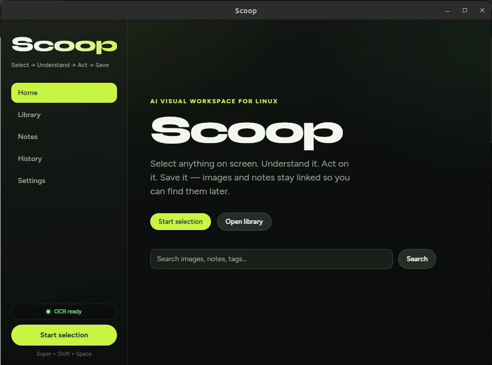
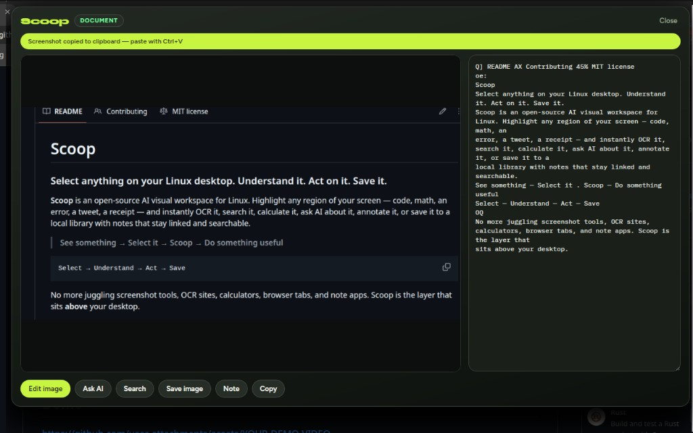

# Scoop

### Select anything on your Linux desktop. Understand it. Act on it. Save it.

**Scoop** is an open-source AI visual workspace for Linux. Highlight any region of your screen — code, math, an error, a tweet, a receipt — and instantly OCR it, search it, calculate it, ask AI about it, annotate it, or save it to a local library with notes that stay linked and searchable.

> **See something → Select it → Scoop → Do something useful**

```text
Select → Understand → Act → Save
```

No more juggling screenshot tools, OCR sites, calculators, browser tabs, and note apps. Scoop is the layer that sits **above** your desktop.

---

## Demo

<!-- Drop your demo video below (MP4/WebM or YouTube/Loom embed). -->

https://github.com/user-attachments/assets/YOUR-DEMO-VIDEO

> **Tip:** Record a 20–40s loop: hotkey → select → OCR → edit → save → search in Library.

### Screenshots

<!-- Replace these placeholders with real PNGs under docs/media/ -->

| Home | Selection toolbar |
|------|-------------------|
|  |  |

| Image editor | Library & linked notes |
|--------------|------------------------|
|  |  |

<p align="center">
  <em>Add your screenshots to <code>docs/media/</code> — filenames above are ready to drop in.</em>
</p>

---

## Why Scoop?

Linux has great terminals and editors. What it lacks is a **fast visual capture → action loop**.

| Without Scoop | With Scoop |
|---------------|------------|
| Screenshot → upload → OCR site → copy → paste | Select → text + actions in one panel |
| Copy numbers → open calculator → retype | Select → **Calculate** |
| Paste into ChatGPT manually | Select → **Ask AI** |
| Screenshots vanish into `~/Pictures` chaos | **Library** + tags + linked **Notes** |
| Dark UI text breaks OCR | Preprocessed OCR tuned for desktop UIs |

Built for people who live in the terminal *and* the browser — developers, researchers, students, power users.

---

## Features

### Capture & understand
- **Global hotkey** — invoke from anywhere (`Super+Shift+Space` by default)
- **Multi-monitor marquee** — freeze-frame overlay, drag to select
- **Smart OCR** — Tesseract with preprocessing (dark UI invert, contrast, upscale, multi-PSM)
- **Content classification** — CODE, MATH, DOCUMENT, and more for contextual actions
- **Auto clipboard** — screenshot copied on select so you can paste immediately

### Act in seconds
- **Ask AI** — question the selection (OpenAI-compatible providers)
- **Search** — open web search with the OCR text
- **Calculate** — local math engine (currency-friendly)
- **Copy** — editable OCR text to clipboard
- **Edit image** — paint-level annotations before you save  
  Pen · Marker · Eraser · Line · Rect · Oval · Arrow · Text · Undo/Redo

### Save & find later
- **Save image** — title + tags → `~/Pictures/Screenshots/`
- **Local Library** — collections, tags, thumbnails, keyword search
- **Notes** — save structured notes from a selection
- **Lineage** — images ↔ notes stay **linked**; search finds either side
- **History** — recent actions with retention controls
- **Unified search** — Home searches library + notes together

### Privacy-first
- Captures are **temporary** until you explicitly save
- API keys in the OS keyring
- Cloud AI only when you enable it and ask
- Everything searchable offline once saved locally

---

## Quick start

### Requirements
- Linux (X11 tested; Wayland improvements welcome)
- [Node.js](https://nodejs.org/) 18+
- [Rust](https://rustup.rs/) (stable)
- System deps for [Tauri 2](https://v2.tauri.app/start/prerequisites/)
- **Tesseract** for OCR (recommended)

### Install & run

```bash
git clone https://github.com/YOUR_USER/Scoop.git
cd Scoop

make install          # npm deps for the desktop app
make install-ocr      # tesseract-ocr + eng (Ubuntu/Debian; needs sudo)
make dev              # Tauri + Vite
```

You can also install Tesseract later and download language packs from **Settings → OCR**
(no reinstall of Scoop required).

Or manually:

```bash
cd apps/desktop
npm install
npm run tauri dev
```

**Default hotkey:** `Super+Shift+Space`  
Also available from the tray menu → **Select**, or **Start selection** in the app.

### Build

```bash
make build           # .deb + AppImage (PATH sanitized for linuxdeploy)
make build-deb       # .deb only
make build-appimage  # AppImage only
```

Artifacts land under `apps/desktop/src-tauri/target/release/bundle/`.

> **AppImage note:** `linuxdeploy` can fail if `PATH` includes a broken symlink loop
> (e.g. `/usr/local/bin/kubectx` → `kubectx/kubectx`). `make build` already uses a
> sanitized `PATH` and `APPIMAGE_EXTRACT_AND_RUN=1`. Fix the host symlink or use
> `make build-deb` if you still hit bundler errors.

---

## How it works

```text
┌─────────────────────────────────────────────────────────┐
│  Global hotkey / tray / Start selection                 │
└──────────────────────────┬──────────────────────────────┘
                           ▼
┌─────────────────────────────────────────────────────────┐
│  Freeze-frame overlay → drag region                     │
└──────────────────────────┬──────────────────────────────┘
                           ▼
┌─────────────────────────────────────────────────────────┐
│  Crop → OCR → classify → clipboard image                │
└──────────────────────────┬──────────────────────────────┘
                           ▼
┌─────────────────────────────────────────────────────────┐
│  Toolbar: preview + text + Edit / Ask AI / Search / …   │
└──────────────────────────┬──────────────────────────────┘
                           ▼
┌─────────────────────────────────────────────────────────┐
│  Library  ↔  Notes  (linked)  ·  History  ·  Settings   │
└─────────────────────────────────────────────────────────┘
```

**Stack:** Tauri 2 · Rust · React · SQLite + FTS5 · Tesseract · OpenAI-compatible AI

---

## Project layout

```text
Scoop/
├── apps/desktop/          # Tauri 2 + React app (the product)
├── docs/                  # Product, architecture, engineering docs
│   └── media/             # Screenshots & demo assets (add yours here)
├── Makefile               # install · dev · build · OCR helpers
└── CONTRIBUTING.md
```

---

## Documentation

| Doc | What you’ll find |
|-----|------------------|
| [Docs index](./docs/README.md) | Full map |
| [Vision](./docs/product/vision.md) | Product principle |
| [MVP scope](./docs/product/mvp-scope.md) | What’s in / out |
| [Architecture](./docs/architecture/overview.md) | System design |
| [Privacy](./docs/architecture/privacy.md) | Retention & cloud rules |
| [Dev setup](./docs/engineering/development-setup.md) | Local environment |
| [QA checklist](./docs/engineering/qa-checklist.md) | Manual release checks |
| [Contributing](./CONTRIBUTING.md) | How to help |

---

## Roadmap (high level)

- [x] Capture loop + OCR + contextual toolbar  
- [x] Library, notes, lineage, unified search  
- [x] Image editor + auto clipboard  
- [ ] Polished packaging (AppImage / Flatpak)  
- [ ] Stronger Wayland support  
- [ ] Local / offline models  
- [ ] HTML-from-UI (v2)  
- [ ] Plugins & automation (v3)  

Ideas and bugs → **GitHub Issues**. PRs welcome.

---

## Contributing

Scoop is open source and **we want your help** — especially Linux desktop edge cases (monitors, DPI, Wayland compositors).

1. Read [CONTRIBUTING.md](./CONTRIBUTING.md)
2. Keep the product principle sacred:

> Can the user get from something **visible on screen** to a **useful result** in seconds?

3. Open a PR with a short test plan (mention X11 vs Wayland when relevant)

---

## Community

- **Issues** — bugs, feature ideas, distro packaging notes  
- **Discussions** — (enable on GitHub) workflows & tips  
- Star the repo if Scoop saves you time — it helps others find it  

---

## License

**MIT** — free to use, fork, and ship. See [`LICENSE`](./LICENSE).

---

<p align="center">
  <strong>Scoop</strong> — the AI layer above your Linux desktop.<br/>
  <sub>Select anything. Do something useful.</sub>
</p>
